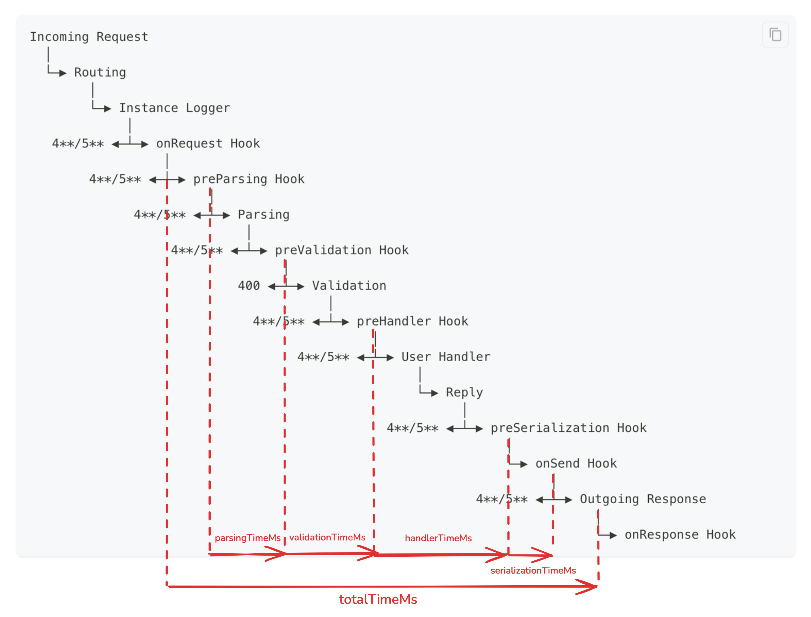

# `fastify-lifecycle-performance-measurement-plugin`

A Fastify plugin that measures and exposes detailed request lifecycle performance metrics.

## What metrics are measured and how?

Look at the following diagram to understand each metric and the stages of the request lifecycle:



## Why is this useful?

This plugin is useful for debugging performance issues in your Fastify application. This is especially useful for high-load applications with low-latency userland handlers to understand how much time is spent in the Fastify core and identify bottlenecks.

## Installation

1. Install the package:

    ```bash
    npm install fastify-lifecycle-performance-measurement-plugin
    ```

2. Register the plugin in your Fastify application:

    ```typescript
    app.register(lifecyclePerformanceMeasurementPlugin);
    ```

## Usage example

```typescript
import {
  lifecyclePerformanceMeasurementPlugin,
  getLifecyclePerformanceMeasurements,
} from 'fastify-lifecycle-performance-measurement-plugin';
import Fastify from 'fastify';

const app = Fastify({ logger: true });

app.register(lifecyclePerformanceMeasurementPlugin);

app.get('/', async () => {
  return { hello: 'world' };
});

app.addHook('onResponse', (request, _, done) => {
  const requestPerformance = getLifecyclePerformanceMeasurements(request);

  // For example, you could log the performance measurements:
  request.log.info(requestPerformance, 'Request performance');

  // Or, you could observe a custom metrics histogram:
  //   metrics.histogram('fastify_lifecycle_total_time_ms').observe(requestPerformance.totalTimeMs);
  //   metrics.histogram('fastify_lifecycle_handler_time_ms').observe(requestPerformance.handlerTimeMs);

  done();
});
```

See the [example app](./examples/simple-app/src/index.ts) for a complete example.

## API

### `lifecyclePerformanceMeasurementPlugin`

A Fastify plugin that adds performance measurement capabilities to your application.

### `getLifecyclePerformanceMeasurements(request)`

Returns an object containing the following performance measurements (in milliseconds):

- `parsingTimeMs` - Time spent parsing the request
- `validationTimeMs` - Time spent validating the request
- `handlerTimeMs` - Time spent in the route handler
- `serializationTimeMs` - Time spent serializing the response
- `totalTimeMs` - Total request processing time
